# Lab 01 - Friday January 29th, 2021 (in class lab)

## Github, Linux Command Line Instructions, Regular Expressions and Visual Programming

***Maintain a repository on github for all your lab work. Inside, you should create a markdown page (lab01.md) for this lab's work. You will be graded by the beginning of the next lab. To submit this assignment, create a text file with 2 lines. The first line should be a link to your github repository and the second link should be the link to your Lab 1 entry. Submit this as the only file to [Submitty](https://submitty.cs.rpi.edu/courses/s21/csci4470).***

> Markdown syntax is [here](https://help.github.com/articles/basic-writing-and-formatting-syntax/) and [here](https://guides.github.com/features/mastering-markdown/) 

# Open Source Software - Spring 2021
## Tommy Sanford

## Lab Reports
[Lab 1](labs/lab-01/report.md)

1. **Bio**

	Junior CS Major

	Discord: tsanford13#2411

	LinkedIn: https://www.linkedin.com/in/thomas-sanford-7919bb18a/ 
	
	
	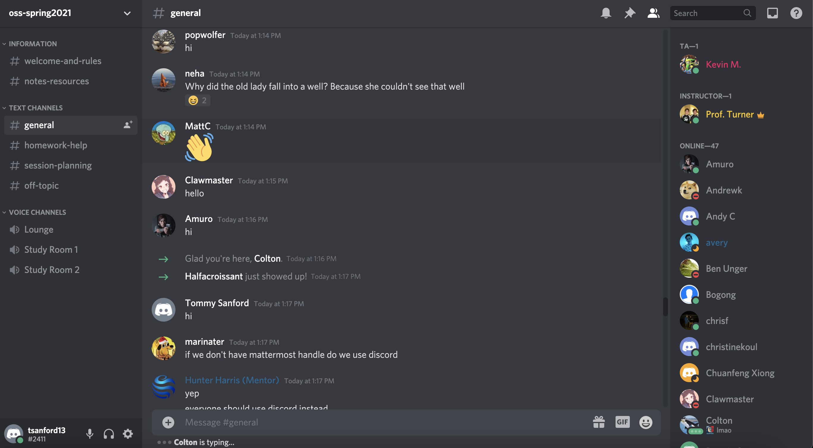

1. **Reading assignments** - make sure to reflect on these in a lab1.md file in your repository 
  
     - Please read the 10 criteria of [Open Source Definition](http://opensource.org/osd) and understand why they are important.  ✅
     - Please read Eric Raymond's article [Smart Questions](http://www.catb.org/esr/faqs/smart-questions.html) How to ask the question The Smart Way.  ✅ 
     - Do you have more suggestions for How To Answer Questions in a Helpful Way (from your past experience)
     	* Always make sure you know your audience. For example, if your audience is an inexperienced programmer, make sure you highlight details that may be assumed knowledge to an experienced programmer.
     	* Be clear and concise in your answer, don't ramble on and on because you'll often lose the interest and or focus of the listener.
  3. Please read chapter 3 of [Free Culture](https://github.com/rcos/CSCI-4470-OpenSource/blob/master/Resources/freeculture.pdf)  ✅
     - Write a short paragraph ( 8 to 10 sentences) of what you got out of reading that chapter.
     - I am not that experienced with regular expression matching at all. Naturally, I questioned the usefulness of this type of program but this chapter has really opened my eyes to how widely used and effective regex matching can be. The snippets of code that were given in the chapter were very simple, elegant, and intuitive to read and understand. Also, this was touched on in the chapter a bit but the language they chose to use was C which I find very odd because string operations in C are often painful. I would personally much rather use something like Python, however the author made a few good points about how the program uses C's poitners and autoincrementation well, which I have to agree with. I learned a lot content wise from this chapter as well as a lot about general programming practices. 
  4. Read the first chapter in [Beautiful Code](https://docs.google.com/viewer?a=v&pid=sites&srcid=ZGVmYXVsdGRvbWFpbnxpb3ZhbmFsZXh8Z3g6MjVjYWFmNjAwYTA0MmMxZA) about the development and implementation (in C) of a very simple grep  ✅
     - You don't need to record anything here on the reading, but it will help you with the exercises on ***grep***, ***egrep***, and ***regex***.

  
1. **Linux** 

  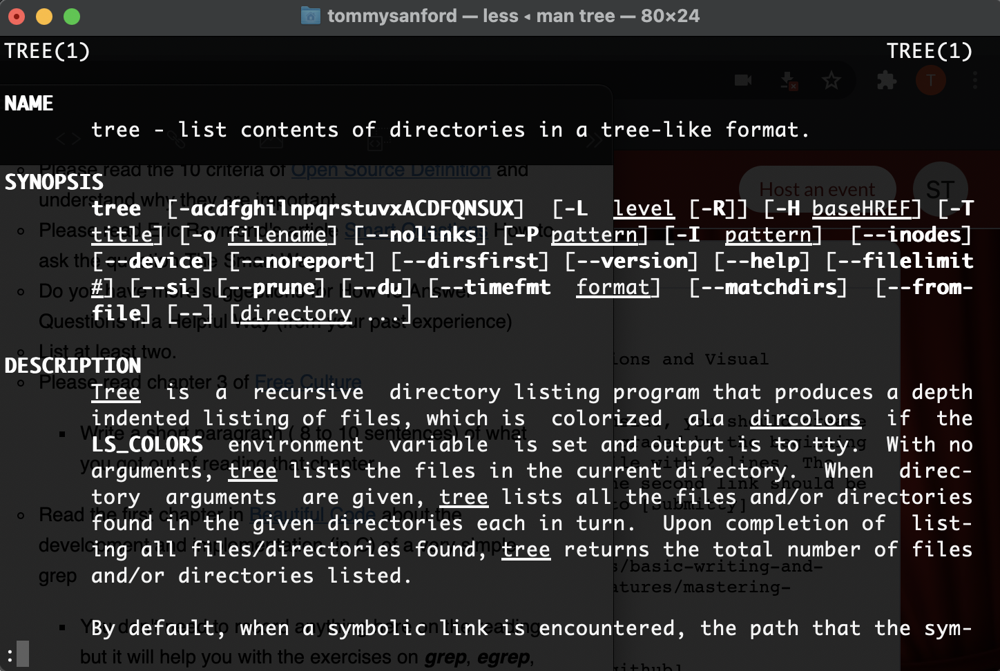

1. **Regex**
	1. Regex Problems
   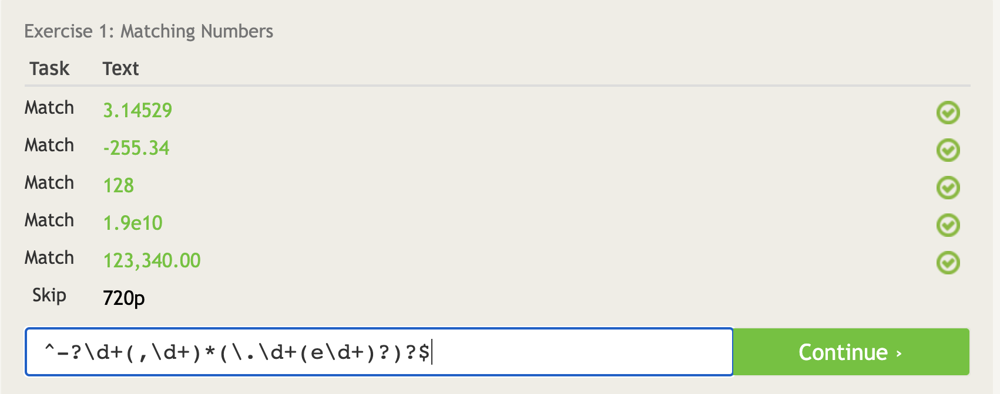
   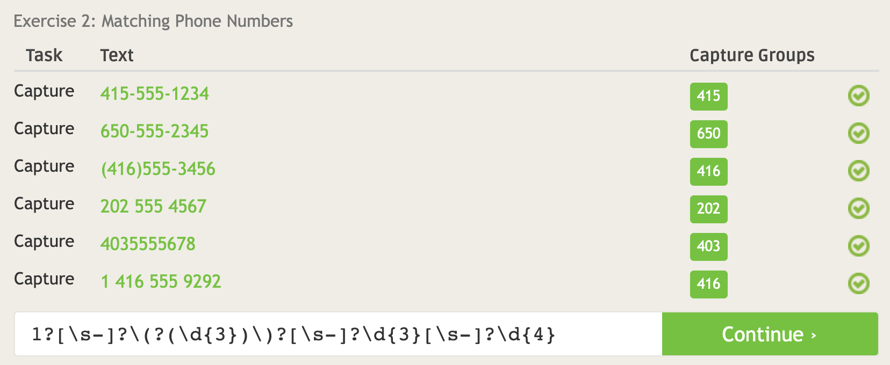
   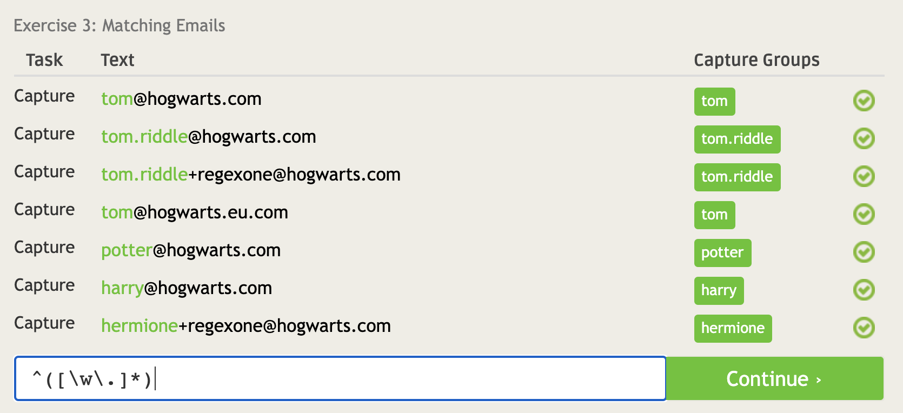
   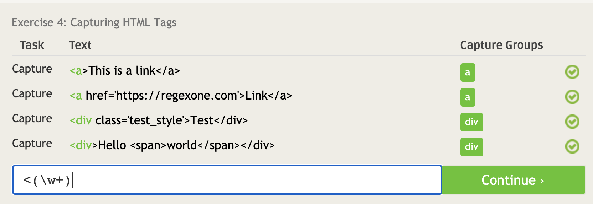
   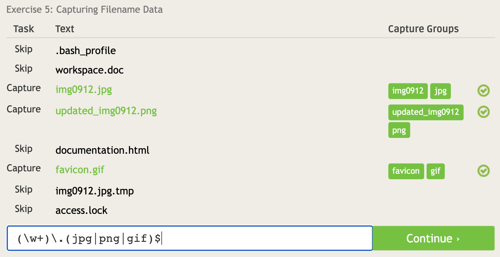
   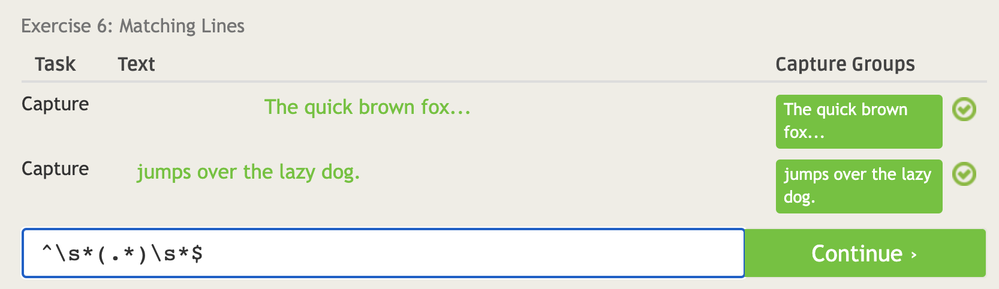
   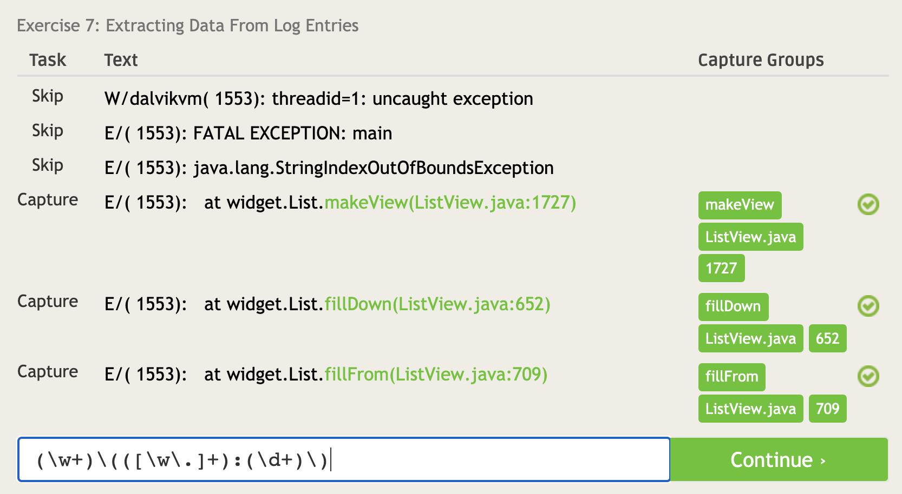
	2. Regex Puzzles
 	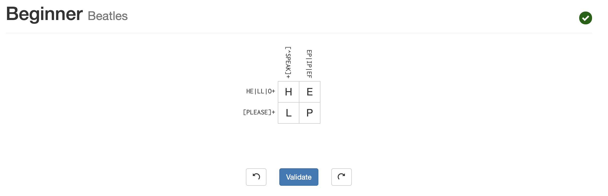
 	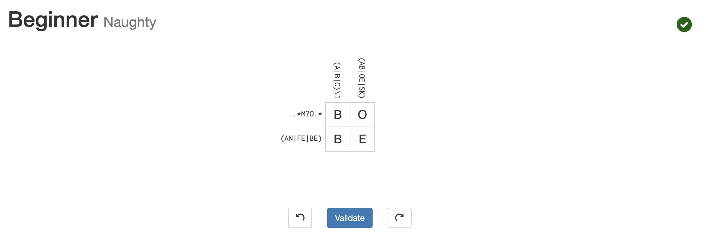
 	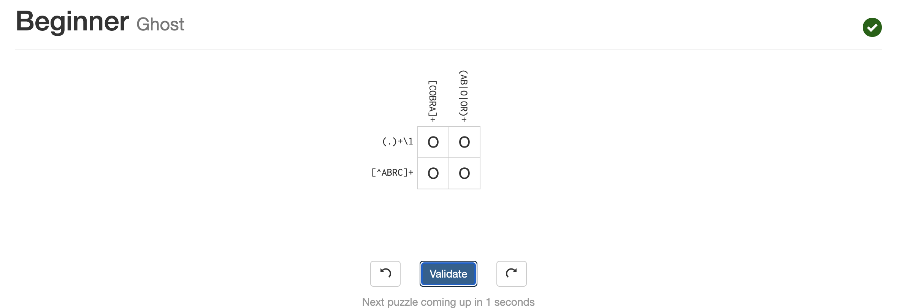
 	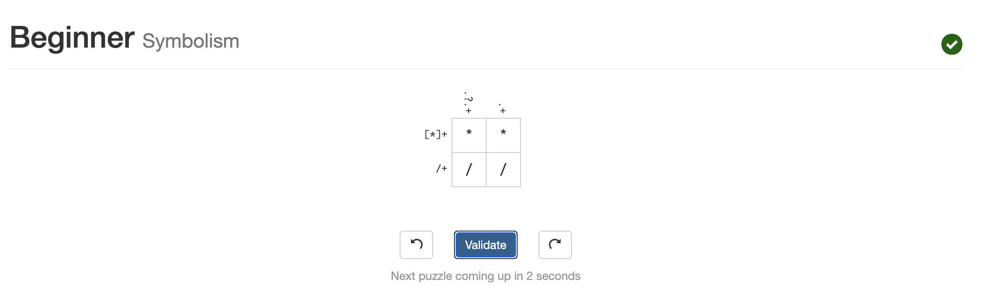

1. **Play with** [Snap](http://snap.berkeley.edu/) or
[Blockly](https://blockly-games.appspot.com/) 
  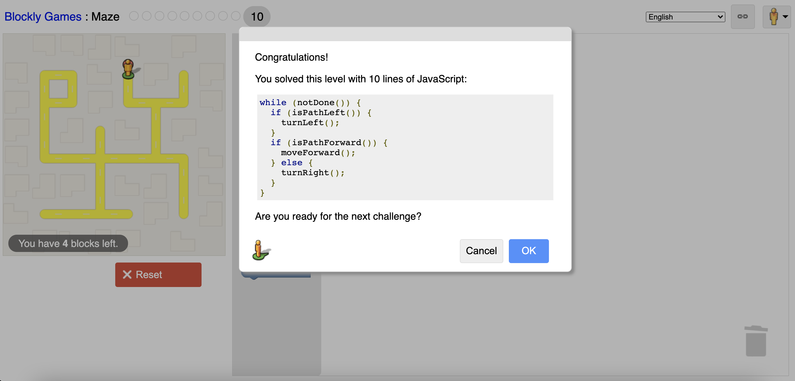

1. **Reflection**

   - Pick an Open Source Project that might be interesting to evaluate
   - Start thinking/finding a problem/project that interests you 
   - Add a paragraph on how you are doing this activity to `lab01.md`
   - Check out [http://aosabook.org/en/index.html](http://aosabook.org/en/index.html) for a list of a number of open source projects and for a discussion of the architectures they use.
